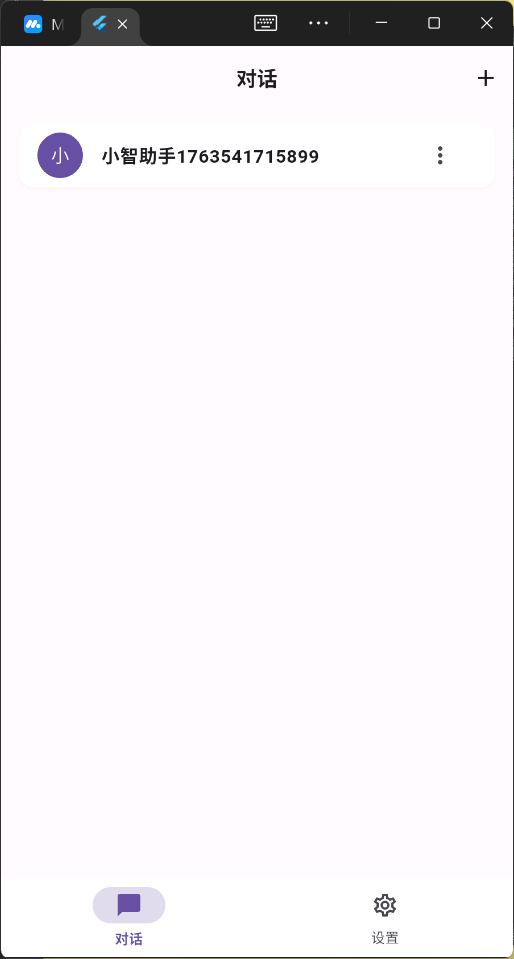
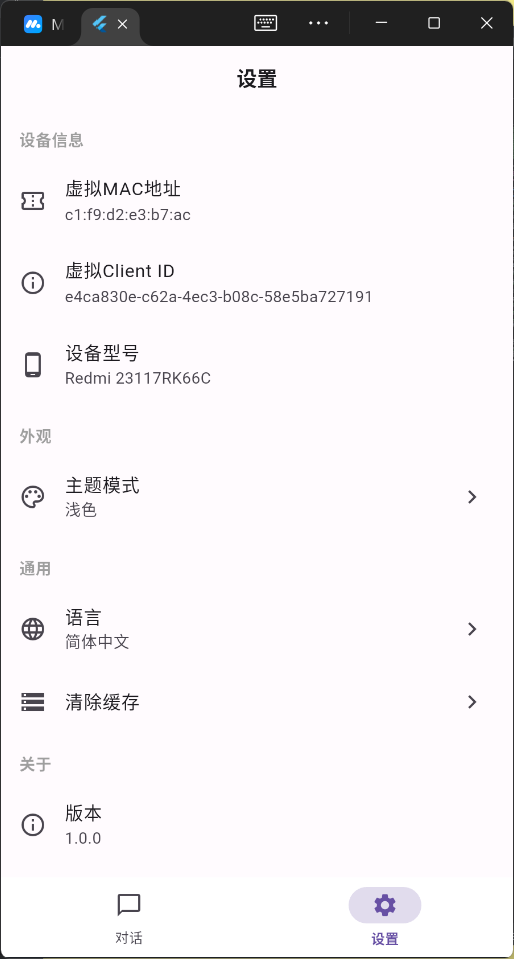
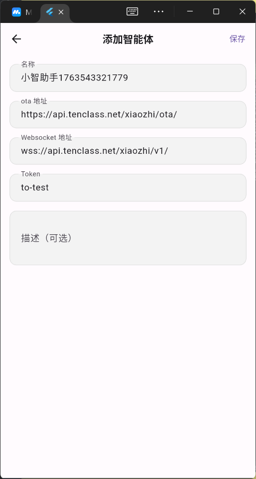
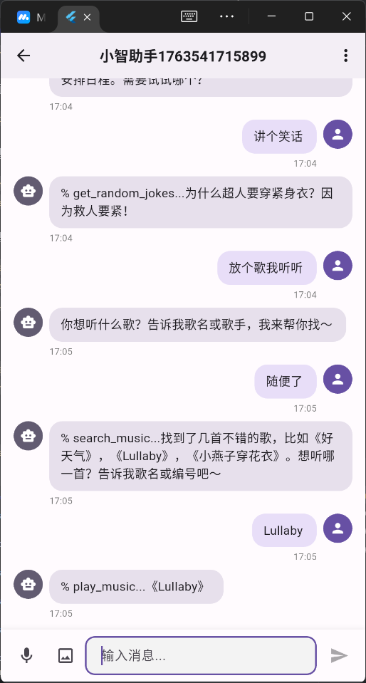
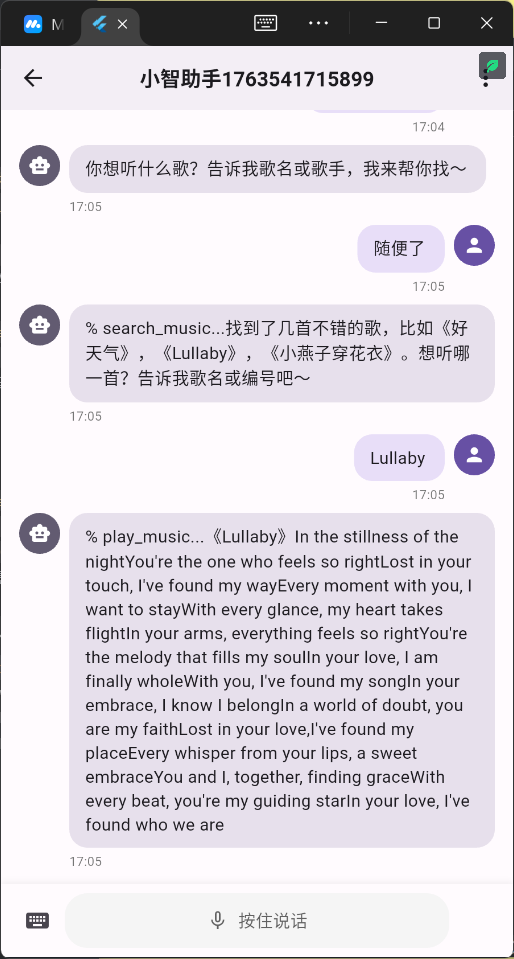

# 小智 AI 助手 (XiaoZhi AI Assistant)

<p align="center">
  
  
  
</p>

一款基于 Flutter 开发的跨平台 AI 聊天助手应用，支持多智能体管理、文字/语音多模态交互，采用 WebSocket 实时通信。只需要登录[小智官网](https://xiaozhi.me) 添加即可使用。提供动态配置，方便你本地调试不同的小智AI后台。


## 支持平台

- [x] Android
- [x] IOS
- [ ] Windows
- [ ] Macos
- [ ] linux
- [ ] Web

## 📱 应用截图

<table>
  <tr>
    <td></td>
    <td></td>
    <td></td>
  </tr>
  <tr>
    <td align="center">智能体列表</td>
    <td align="center">设置列表</td>
    <td align="center">添加智能体</td>
  </tr>
  <tr>
    <td></td>
    <td></td>
    <td></td>
  </tr>
  <tr>
    <td align="center">对话界面</td>
    <td align="center">语音交互</td>
    <td></td>
  </tr>
</table>

## ✨ 核心功能

- 🤖 **多智能体管理** - 支持添加、编辑、删除多个 AI 智能体配置
- 💬 **实时对话** - 基于 WebSocket 的流式对话，支持文本和语音实时交互
- 🎤 **语音交互** - 支持语音输入（STT）和语音输出（TTS），使用 Opus 音频编解码
- 📱 **跨平台支持** - Android、iOS、Web、Windows、macOS、Linux
- 🎨 **Material 3 设计** - 现代化 UI 设计，支持浅色/深色主题
- 🔄 **连接管理** - 实时显示连接状态，支持断线重连
- 💾 **本地存储** - 智能体配置本地持久化存储

## 🏗️ 技术架构

### 架构模式

- **Clean Architecture** - 清晰的分层架构
- **MVVM Pattern** - Model-View-ViewModel 设计模式
- **Repository Pattern** - 数据访问抽象层

### 核心技术栈

#### 状态管理

- `flutter_riverpod ^2.5.0` - 类型安全的状态管理方案

#### 网络层

- `dio ^5.4.0` - HTTP 客户端
- `retrofit ^4.0.0` - RESTful API 类型安全封装
- WebSocket - 实时通信协议

#### 数据持久化

- `hive ^2.2.3` - 高性能 NoSQL 数据库
- `shared_preferences ^2.2.2` - 轻量级键值存储

#### 路由导航

- `go_router ^13.0.0` - 声明式路由管理

#### 数据模型

- `freezed ^2.4.7` - 不可变数据类生成
- `json_serializable ^6.7.1` - JSON 序列化

#### 音频处理

- `record ^6.1.2` - 音频录制
- `opus_flutter ^3.0.3` - Opus 音频编解码
- `audio_session ^0.2.2` - 音频会话管理

#### UI 组件

- `cached_network_image ^3.3.1` - 图片缓存加载
- `shimmer ^3.0.0` - 加载骨架屏效果

#### 工具库

- `device_info_plus ^12.2.0` - 设备信息获取
- `permission_handler ^11.3.0` - 权限管理
- `uuid ^4.3.3` - UUID 生成
- `logging ^1.3.0` - 日志记录
- `vibration ^3.1.4` - 震动反馈

## 📁 项目结构

```
lib/
├── main.dart                          # 应用入口
├── app/
│   ├── routes/                        # 路由配置
│   │   ├── app_routes.dart
│   │   └── app_pages.dart
│   ├── themes/                        # 主题配置
│   │   ├── app_theme.dart
│   │   ├── app_colors.dart
│   │   └── app_text_styles.dart
│   └── config/
│       └── app_config.dart
├── core/                              # 核心层
│   ├── network/                       # 网络层
│   │   ├── dio_client.dart
│   │   ├── xiaozhi_websocket_manager.dart
│   │   └── xiaozhi_ota_service.dart
│   ├── storage/                       # 存储层
│   │   └── storage_service.dart
│   ├── utils/                         # 工具类
│   │   ├── logger.dart
│   │   ├── toast_util.dart
│   │   ├── audio_util.dart
│   │   └── xiaozhi_device_info_util.dart
│   ├── providers/                     # 全局 Provider
│   │   └── agent_provider.dart
│   └── constants/
│       └── api_constants.dart
├── data/                              # 数据层
│   ├── models/                        # 数据模型
│   │   ├── agent_model.dart
│   │   ├── message_model.dart
│   │   └── user_model.dart
│   ├── repositories/                  # 数据仓库
│   │   ├── agent_repository.dart
│   │   └── chat_repository.dart
│   └── providers/                     # 数据源
│       ├── remote/
│       └── local/
└── presentation/                      # 表现层
    ├── pages/                         # 页面
    │   ├── main/                      # 主页面（底部导航）
    │   ├── conversation/              # 对话列表
    │   │   └── widgets/
    │   │       ├── agent_card.dart
    │   │       └── agent_list.dart
    │   ├── chat/                      # 聊天页面
    │   │   ├── chat_page.dart
    │   │   └── widgets/
    │   │       ├── message_bubble.dart
    │   │       ├── message_list.dart
    │   │       ├── chat_input_bar.dart
    │   │       └── voice_record_button.dart
    │   ├── agent_config/              # 智能体配置
    │   └── settings/                  # 设置页面
    └── widgets/                       # 全局组件
```

## 🚀 快速开始

### 环境要求

- Flutter SDK: 3.9.2 或更高版本
- Dart SDK: 3.9.2 或更高版本
- Android Studio / Xcode（用于移动端开发）
- NDK 版本 21 或更高（Android）

### 安装步骤

1. **克隆项目**

```bash
git clone https://github.com/eiriksgata/xiaozhi-client-flutter.git
cd xiaozhi-client-flutter
```

2. **安装依赖**

```bash
flutter pub get
```

3. **生成代码**（Freezed、JSON 序列化等）

```bash
dart run build_runner build --delete-conflicting-outputs
```

4. **运行应用**

```bash
# Android
flutter run -d android

# iOS
flutter run -d ios

# Web
flutter run -d chrome

# Windows
flutter run -d windows
```

### 开发模式（代码自动生成）

```bash
dart run build_runner watch --delete-conflicting-outputs
```

## 🔧 配置说明

### Android 配置

最低 SDK 版本已设置为 21（Android 5.0），位于 `android/app/build.gradle.kts`：

```kotlin
defaultConfig {
    minSdk = 21
    targetSdk = flutter.targetSdkVersion
}
```

如需修改应用 ID，编辑 `android/app/build.gradle.kts`：

```kotlin
applicationId = "com.xiaozhi.client"
```

### iOS 配置

最低支持 iOS 12.0，配置位于 `ios/Podfile`。

### 权限配置

应用需要以下权限：

- 📷 相机（拍照功能）
- 🎤 麦克风（语音输入）
- 📁 存储（图片、音频文件）

权限配置已添加到：

- Android: `android/app/src/main/AndroidManifest.xml`
- iOS: `ios/Runner/Info.plist`

## 📖 使用说明

### 1. 添加智能体

首次使用需要添加智能体配置：

1. 点击对话页面的 "+" 按钮
2. 填写智能体信息：
   - **名称**: 智能体显示名称
   - **OTA 地址**: OTA 认证服务地址
   - **WebSocket 地址**: WebSocket 连接地址（wss://）
   - **Token**: API 认证令牌
   - **描述**: 智能体简介（可选）
3. 点击"保存"

### 2. 开始对话

1. 在对话列表中点击智能体卡片
2. 等待连接建立（顶部显示连接状态）
3. 开始文字或语音交互：
   - **文字输入**: 底部输入框输入文字，点击发送
   - **语音输入**: 点击麦克风图标，长按说话，松开发送

### 3. 连接管理

- 应用会自动建立 WebSocket 连接
- 顶部状态栏显示连接状态（仅在非连接状态显示）
- 断线时可点击"重连"按钮手动重新连接

## 🎨 主题定制

应用支持浅色和深色主题，基于 Material 3 设计规范。

主题配置文件位于：

- `lib/app/themes/app_theme.dart` - 主题定义
- `lib/app/themes/app_colors.dart` - 颜色常量
- `lib/app/themes/app_text_styles.dart` - 文本样式

## 🧪 测试

```bash
# 运行所有测试
flutter test

# 运行测试并生成覆盖率报告
flutter test --coverage

# 运行特定测试文件
flutter test test/presentation/pages/chat/chat_page_test.dart
```

## 🔨 构建发布版本

### Android APK

```bash
flutter build apk --release
```

### Android App Bundle（推荐用于 Google Play）

```bash
flutter build appbundle --release
```

### iOS

```bash
flutter build ios --release
```

### Web

```bash
flutter build web --release
```

## 📝 开发规范

### 代码风格

- 遵循 [Effective Dart](https://dart.dev/guides/language/effective-dart) 规范
- 使用 `flutter_lints` 进行静态分析
- 命名规范：
  - 文件名：`lowercase_with_underscores.dart`
  - 类名：`PascalCase`
  - 变量/方法：`lowerCamelCase`
  - 常量：`lowerCamelCase` 或 `SCREAMING_SNAKE_CASE`

### Git Commit 规范

```
feat: 添加新功能
fix: 修复 bug
style: 代码格式调整
refactor: 代码重构
test: 添加测试
docs: 文档更新
chore: 构建/工具链更新
```

### 代码格式化

```bash
# 格式化所有代码
dart format lib/ test/

# 静态分析
flutter analyze
```

## 🐛 常见问题

### 1. 编译错误：Platform version 19 is unsupported

**解决方案**：已在 `android/gradle.properties` 中添加：

```properties
android.ndk.suppressMinSdkVersionError=21
```

### 2. Freezed 生成代码失败

**解决方案**：

```bash
flutter clean
flutter pub get
dart run build_runner build --delete-conflicting-outputs
```

### 3. WebSocket 连接失败

**检查项**：

- 确认智能体配置的 WebSocket 地址正确（wss:// 或 ws://）
- 检查网络连接
- 查看 OTA 认证是否成功
- 确认设备是否已在平台注册（查看注册码）

## 🤝 贡献指南

欢迎提交 Issue 和 Pull Request！

1. Fork 本仓库
2. 创建特性分支 (`git checkout -b feature/AmazingFeature`)
3. 提交更改 (`git commit -m 'feat: Add some AmazingFeature'`)
4. 推送到分支 (`git push origin feature/AmazingFeature`)
5. 提交 Pull Request

## 📄 开源协议

本项目采用 MIT 协议 - 详见 [LICENSE](LICENSE) 文件

## 👥 作者

- **Eiriksgata** - [GitHub](https://github.com/eiriksgata)

## 🙏 致谢

感谢所有为本项目做出贡献的开发者！

---

<p align="center">
  Made with ❤️ by Eiriksgata
</p>
